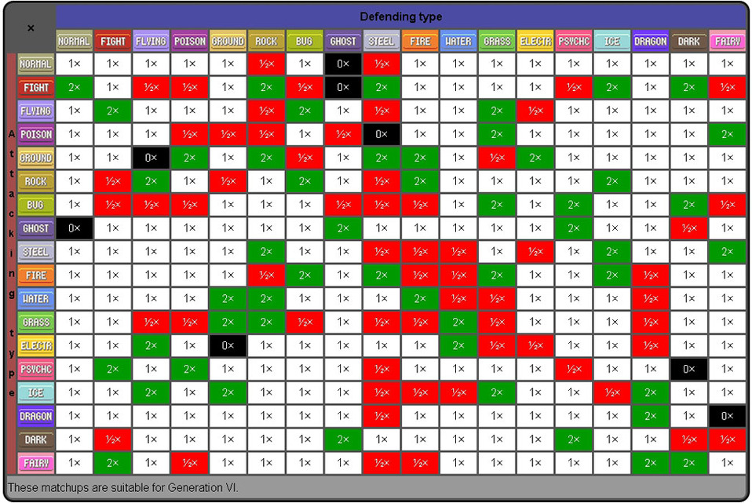

# Ember CRUD

## Lesson Details
### Foundations
At this point, students have already learned how to:

- Create Ember Components to represent UI elements and encapsulate related data and behavior.
- Use `ember-data` to set up Models representing business data.
- Link the `ember-data` data store to a JSON API through an Adapter.
- Set up a mock back-end using `ember-cli-mirage`

### Objectives
By the end of this lesson, students should be able to:

- Define a one-to-one relationship between different Models.
- Define a one-to-many relationship between different Models.
- Define a many-to-many relationship between different Models.
- Define a self-referential relationship on a single Model.
- Set up mocks for interrelated models (of each type above) using Mirage Fixtures.

### Setup
1. Fork and clone this repo.
2. Run `npm install && bower install`
3. Run `ember install ember-legacy-views`
4. Run `ember install ember-cli-mirage`, but _do not_ overwrite the `config.js` file. Additionally, delete the `scenarios` directory.

## `ember-data` Associations
By the end of the last lesson, `ember-crud`, we set out to have an Ember application that could perform CRUD on two separate and unrelated resources, 'pokemon' and 'items'. This is useful for a demonstration, but most of the time (as you probably know by now) your application will need to employ some form of relationship. In this lesson, we'll explore how three different kinds of relationships - one-to-one, one-to-many, and many-to-many - can be implemented in an Ember application, and how test fixtures can be built for that kind of relationship. We will _not_ be focusing on CRUD; that's the topic of the next lesson.

### One-to-Many Relationship

Pokemon games have been produced since 1996, and there are currently six generations of games. Each generation of games takes place in a different region of the 'world', and consequently introduces a new set of Pokemon into the large (and growing) Pokemon universe.

A 'generation' has :
* a name (with date range)
* a description (taken from Wikipedia) - one long string
* a list of games in that generation, represented as an array of strings

Let's go ahead and create a Model and Adapter for the 'generation' resource; afterwards, we'll make a Mirage fixture for them to hook into.
```bash
ember g model generation
ember g adapter generation
```

Inside the 'generation' Model, let's define the following schema:
```javascript
export default DS.Model.extend({
  name: DS.attr('string'),
  description: DS.attr('string'),
  games: DS.attr()
});
```
> `games` is going to be an array, which is not one of the standard types that DS.attr can create, so we're just going to leave it unconfigured.

We'll also need to make some small modifications to the adapter - basically, it should be the same as the adapter for 'item'.
```javascript
import ApplicationAdapter from '../application/adapter';

export default ApplicationAdapter.extend({
  namespace: 'api'
});
```

Next, we would typically need to make a Mirage test fixture with some data inside Mirage; fortunately, one has already been created for you at `fixtures/generations.js`.

Let's add routes to our new resource inside `config.js`.
```javascript
this.get('/generations');
this.get('/generations/:id');
this.post('/generations');
this.put('/generations/:id');
this.del('/generations/:id');
```

Just for testing purposes, let's create a new Route for the 'index' view state (`ember g route index`), and add both 'pokemon' and 'generations' to the `model` method on that Route.
```javascript
export default Ember.Route.extend({
  model: function(){
    return {
      generations: this.store.findAll('generation'),
      pokemon: this.store.findAll('pokemon')
    }
  }
});
```
If we then open up the Ember Inspector to the 'Data' tab, all of our data should be visible!

Now that the groundwork has been laid, let's come back to the topic of associations. In this app, we will model the relationship between resources 'generation' and 'pokemon' as a one-to-many relationship, where one 'generation' is associated with many different 'pokemon'.

We can define this relationship in the 'generation' Model as follows:
```javascript
export default DS.Model.extend({
  name: DS.attr('string'),
  description: DS.attr('string'),
  games: DS.attr(),
  pokemon: DS.hasMany('pokemon', {async: true})
});
```
> `{async: true}` is a configuration setting on `DS.hasMany` that controls a kind of behavior called 'eager/lazy loading'. Don't worry about the details on this right now.

In the 'pokemon' Model, we need to change the 'generation' property from being a number to being a relationship.
```javascript
export default DS.Model.extend({
  nationalPokeNum: DS.attr('number'),
  name: DS.attr('string'),
  typeOne: DS.attr('string'),
  typeTwo: DS.attr('string'),
  // generation: DS.attr('number')
  generation: DS.belongsTo('generation', {async: true})
});
```

Finally, we need to update the content of our fixture so that it has the correct data. Copy the content from `fixtures/generations-ref2.js` and paste it over (i.e. overwrite) the content of `fixtures/generations.js`.

If we open up the Ember Inspector again, in the Data tab, we should be able to see all of the different data types that have been loaded. If we click one of the Pokemon (say, Bulbasaur), navigate to where it says `generation`, send that value to `$E`, and then write `$E.get('content').get('name')`, we should get back the string "First Generation (1996–1998)".

If we go the opposite way, by clicking the first Generation, sending its `pokemon` property to `$E`, and then writing `$E.get('content').forEach(function(p){console.log(p.get('name'));})`, we should see a response like this:
```
Bulbasaur
Ivysaur
Venusaur
Charmander
Charmeleon
Charizard
Squirtle
Wartortle
Blastoise
```

### One-to-One Relationship
As mentioned above, each generation (with one exception, which we'll ignore) takes place in one and only one region of the world. If our app were to have another resource called 'region', it would have a one-to-one relationship with 'generation'.

Suppose that a 'region' has :
* a name
* an array of names of badges that can be collected in the region

Accordingly, we would need a Model like this:
```javascript
export default DS.Model.extend({
  name: DS.attr('string'),
  badges: DS.attr()
});
```
This Model will need an Adapter similar to the ones we made for 'generation', 'item', and 'pokemon'. In order to have some seed data, we will also need a Mirage fixture - one has been provided here at `fixtures/regions.js` - with routes set up just like those of 'generation' in the previous example.

With all that in place, if we add Regions to our 'index' Route's `model` function, we should be able to see them in the Data tab; once we do, we can begin to add relationships.

To make a one-to-one relationship in Ember, both Models must have a `belongsTo` property, each referring to the other Model.
**region**
```javascript
export default DS.Model.extend({
  name: DS.attr('string'),
  badges: DS.attr(),
  // generation: DS.attr('number')
  generation: DS.belongsTo('generation', {async: true})
});
```
**generation**
```javascript
export default DS.Model.extend({
  name: DS.attr('string'),
  description: DS.attr('string'),
  games: DS.attr(),
  pokemon: DS.hasMany('pokemon', {async: true}),
  region: DS.belongsTo('region', {async: true})
});
```
We also need to add in ID values to the fixture data for both regions and generations. Fixture files have been provided with the correct data - simply replace the contents of `fixtures/generations.js` and `fixtures/regions.js` with the contents of `fixtures/generations-ref2.js` and `fixtures/regions-ref2.js`, respectively.
```javascript
{
  id: 1,
  name: 'Kanto',
  badges: ['boulder', 'cascade', 'thunder', 'rainbow', 'soul', 'marsh', 'volcano', 'earth'],
  generation: 1
},
//...
```
```javascript
{
  id: 1,
  name: 'First Generation (1996–1998)',
  description: 'The original Pokémon games are Japanese role-playing video games (RPGs) with an element of strategy, and were created by Satoshi Tajiri for the Game Boy. These role-playing games, and their sequels, remakes, and English language translations, are still considered the "main" Pokémon games, and the games with which most fans of the series are familiar.',
  games: ['red', 'green', 'blue', 'yellow'],
  region: 1
},
```

To test these relationships, all we need to do is follow the same approach as the previous example and open up the Ember Inspector to its Data tab.

### Many-to-Many Relationship

One of the core ideas of the Pokemon games is that Pokemon come in different "types", such as FIRE, WATER, etc. These types not only describe the nature of a particular Pokemon, they also define the types of attacks that a Pokemon is weak (or strong) against. A Pokemon may have either one or two types; for instance, Bulbasaur is both GRASS- and POISON-typed. However, as there are only 18 "types", and over 700 Pokemon, there are many Pokemon who belong to the same type(s). We can infer from this that if our application were to have 'type' resource, it would need to have a many-to-many relationship with our 'pokemon' resource.

A 'type' has :
* a name
> Just one property for now, but we'll be adding a bunch more in the next example.

Therefore, a Model for it would look like:
```javascript
export default DS.Model.extend({
  name: DS.attr('string')
});
```
Test data for this resource is available at `fixtures/types.js`, but we'll need to add routes for 'types' to Mirage's `config.js` file.

To set up this many-to-many relationship, we need to edit the models to reflect the relationship and update the fixtures with the appropriate data. Once that's done, we can update our Components and Templates so that they refer to the new properties.

##### Editing the Models
In order for the many-to-many to be handled correctly, we'll need to replace `typeOne` and `typeTwo` in the Pokemon model with a `hasMany` property, `types`. This will mean needing to change some UI code, but we can get to that later.
```javascript
export default DS.Model.extend({
  nationalPokeNum: DS.attr('number'),
  name: DS.attr('string'),
  // typeOne: DS.attr('string'),
  // typeTwo: DS.attr('string'),
  types: DS.hasMany('type', {async: true}),
  // generation: DS.attr('number')
  generation: DS.belongsTo('generation', {async: true})
});
```

##### Updating the Fixtures
Since we want to link 'pokemon' to 'types', we need to have data somewhere indicating which 'pokemon' connect with which 'types', and this means editing our Mirage fixtures. Each 'pokemon' will need to have a new property called `types` whose value is an array of ids, like this:
```javascript
{
  id: 1,
  nationalPokeNum: 1,
  name: 'Bulbasaur',
  types: [10, 14],
  generation: 1
},
```
In real life, this work might be tedious. Thankfully, another reference fixture with all of these updates has been provided - simply copy the contents of `fixtures/pokemon-ref3.js` and overwrite the contents of `fixtures/pokemon.js`.

What about the inverse side of the relationship, referencing specific 'pokemon' from each 'type'? As tedious as the previous step might have been to do by hand, adding 'pokemon' id values for _every Pokemon of a given type_ to _each object in the 'types' fixture_ sounds significantly worse. Fortunately, as it turns out, Ember has our backs on this one. Because we've set up this relationship as many-to-many, by default Ember will automatically calculate the inverse side of the relationship, allowing us to reference 'pokemon' from a given 'type' without doing any additional work.
> This default behavior can be overriden, and we will see that in the last example.

##### Changing the UI
Since we're now using `types` instead of `typeOne` and `typeTwo`, we need to update the 'pokemon-snippet' Component to handle `types`.

There are two lines in the 'pokemon-snippet' Component Template that reference our old approach to types:
```html
<p> Type: {{pokemon.typeOne}} {{#if twoTypes}}/ {{pokemon.typeTwo}}{{/if}} </p>
```
and
```html
<p> Type: {{input valueBinding='pokemon.typeOne'}} / {{input valueBinding='pokemon.typeTwo'}} </p>
```
Frankly, since each Component represents one Pokemon, the approach that would probably change the fewest things would be to create some _computed properties on the Component_ , called `typeOneName` and `typeTwoName`, which derive their values from the `types` property on the Model.
```javascript
export default Ember.Component.extend({
  tagName: 'li',
  typeOneName: Ember.computed('pokemon.@each.types', function(){
    // @each tells Ember to watch for changes to the values of each element, not just the length of the array
    // objectAt allows us to pull out either the first or second 'type'
    return this.get('pokemon.types').objectAt(0).get('name');
  }),
  typeTwoName: Ember.computed('pokemon.@each.types', function(){
    return this.get('pokemon.types').objectAt(1).get('name');
  }),
  twoTypes: Ember.computed('pokemon.typeOne', 'pokemon.typeTwo', function(){
    return this.get('pokemon.typeTwo') && this.get('pokemon.typeTwo') !== this.get('pokemon.typeOne');
  }),
  isExpanded: false,
  isEditable: false,
  actions: {
    // ...
  }
});
```
Doing so means we need to do some minor refactoring of `twoTypes`:
```javascript
export default Ember.Component.extend({
  // ...
  twoTypes: Ember.computed('pokemon.types', function(){
    return this.get('pokemon.types').get('length') === 2 && this.get('typeOneName') !== this.get('typeTwoName');
  }),
  // ...
});
```
But with that done, all that's left is going through the Template and replacing `pokemon.typeOne` and `pokemon.typeTwo` with `typeOneName` and `typeTwoName`, respectively.
```html
{{#unless isEditable}} {{!-- Non-editable Version --}}

  <strong>#{{pokemon.nationalPokeNum}} : {{pokemon.name}}</strong>
  <button {{action 'toggleExpanded'}}>
    {{#unless isExpanded}}EXPAND{{else}}COLLAPSE{{/unless}}
  </button>
  {{#if isExpanded}}
    <button {{action 'toggleEditable'}}>EDIT</button>
    <button {{action 'destroyPokemon'}}>DELETE</button>
    <p> Generation: {{pokemon.generation.name}} </p>
    <p> Type: {{typeOneName}} {{#if twoTypes}}/ {{typeTwoName}}{{/if}} </p>
  {{/if}}

{{else}}  {{!-- Editable Version --}}

  <strong>
    #{{input valueBinding='pokemon.nationalPokeNum'}} : {{input valueBinding='pokemon.name'}}
  </strong>
  <button {{action 'toggleExpanded'}}>
    {{#unless isExpanded}}EXPAND{{else}}COLLAPSE{{/unless}}
  </button>
  <button {{action 'toggleEditable'}}>CONFIRM EDIT</button>
  <button {{action 'destroyPokemon'}}>DELETE</button>
  <p> Generation: {{input valueBinding='pokemon.generation.name'}} </p>
  <p> Type: {{input valueBinding='typeOneName'}} / {{input valueBinding='typeTwoName'}} </p>

{{/unless}}
```
> Well... not quite. As written, if you try change the type of a Pokemon through 'pokemon-snippet' when it's in "editable" mode, it will simply change the name of the type instead of changing the relation. We'll come back to this when we look at doing CRUD with associations.

### Self-Referential Relationship

As mentioned earlier, the key thing that a Pokemon's type does is define the types of attacks that some particular Pokemon is weak (or strong) against. In essence, a type is related to _other types_, in one of four ways:
  1. "Super-effective" attack (2X normal damage)
  2. Normal attack
  3. "Not very effective" attack (0.5X normal damage)
  4. "Had no effect" (0 damage)

Because the 'item' resource will need to refer any number of other 'items', this relationship could be described as "self-referential".

> As you can see in the diagram, the interrelationship between the various different types of Pokemon is _complex_. Don't worry - it doesn't matter if we get the data right!

Defining a self-referential relationship in Ember is basically the same as defining any other kind of relationship: for `type`, we can simply create a new property in the Model called `doubleDamageFrom` and make it a `hasMany` or `belongsTo` with respect to `type`.
```javascript
export default DS.Model.extend({
  name: DS.attr('string'),
  pokemon: DS.hasMany('pokemon', {async: true}),
  doubleDamageFrom: DS.hasMany('type', {async: true})
});
```

`doubleDamageFrom` defines one half of the relationship between one type and other types; how then could we refer back to a parent 'type' from one of the `doubleDamageFrom` 'types'? We'd need to define another property, perhaps `doubleDamageTo`, which also refers to multiple 'types'.
```javascript
export default DS.Model.extend({
  name: DS.attr('string'),
  pokemon: DS.hasMany('pokemon', {async: true}),
  doubleDamageFrom: DS.hasMany('type', {async: true}),
  doubleDamageTo: DS.hasMany('type', {async: true})
});
```
But this just establishes two separate, unconnected relations. To tell Ember that 'doubleDamageTo' is the opposite of 'doubleDamageFrom' (and vice versa) requires that we define each as the "inverse" operation of the other by passing in a reference to the opposite property, under the key `inverse`:
```javascript
export default DS.Model.extend({
  name: DS.attr('string'),
  pokemon: DS.hasMany('pokemon', {async: true}),
  doubleDamageFrom: DS.hasMany('type', {async: true, inverse: 'doubleDamageTo'}),
  doubleDamageTo: DS.hasMany('type', {async: true})
});
```
> If for whatever reason we didn't want there to be an inverse relationship - for instance, if having an inverse relationship didn't make sense within the scope of the problem - we would need to specify `inverse: null`.

Let's also create two additional properties, `halfDamageFrom` and `noDamageFrom`, along with their inverses:
```javascript
export default DS.Model.extend({
  name: DS.attr('string'),
  pokemon: DS.hasMany('pokemon', {async: true}),
  doubleDamageFrom: DS.hasMany('type', {async: true, inverse: 'doubleDamageTo'}),
  doubleDamageTo: DS.hasMany('type', {async: true}),
  halfDamageFrom: DS.hasMany('type', {async: true, inverse: 'halfDamageTo'}),
  halfDamageTo: DS.hasMany('type', {async: true}),
  noDamageFrom: DS.hasMany('type', {async: true, inverse: 'noDamageTo'}),
  noDamageTo: DS.hasMany('type', {async: true})
});
```

If we copy the data from `fixtures/types-ref3.js` into `fixtures/types.js`, and examine the types from the Ember Inspector, we should be able to see these relationships there!

<!-- ## Additional Resources
List additional related resources such as videos, blog posts and official documentation.
- Item 1
- Item 2
- Item 3 -->
