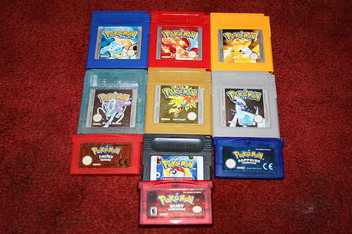
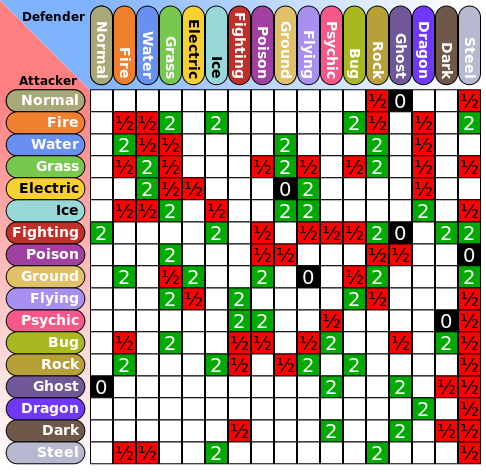

# Ember CRUD

## Lesson Details
### Foundations
At this point, students have already learned how to:

- Create Ember Components to represent UI elements and encapsulate related data and behavior.
- Use `ember-data` to set up Models representing business data.
- Link the `ember-data` data store to a JSON API through an Adapter.
- Set up a mock back-end using `ember-cli-mirage`

### Objectives
By the end of this lesson, students should be able to:

- Define a one-to-one relationship between different Models.
- Define a one-to-many relationship between different Models.
- Define a many-to-many relationship between different Models.
- Define a self-referential relationship on a single Model.
- Set up mocks for interrelated models (of each type above) using Mirage Fixtures.

### Setup
1. Fork and clone this repo.
2. Run `npm install && bower install`
3. Run `ember install ember-legacy-views`
4. Run `ember install ember-cli-mirage`, but _do not_ overwrite the `config.js` file. Additionally, delete the `scenarios` directory.

## `ember-data` Associations
By the end of the last lesson, `ember-crud`, we set out to have an Ember application that could perform CRUD on two separate and unrelated resources, 'pokemon' and 'items'. This is useful for a demonstration, but most of the time (as you probably know by now) your application will need to employ some form of relationship. In this lesson, we'll explore how three different kinds of relationships - one-to-one, one-to-many, and many-to-many - can be implemented in an Ember application, and how test fixtures can be built for that kind of relationship. We will _not_ be focusing on CRUD; that's the topic of the next lesson.

### One-to-Many Relationship

Pokemon games have been produced since 1996, and there are currently six generations of games. Each generation of games takes place in a different region of the 'world', and consequently introduces a new set of Pokemon into the large (and growing) Pokemon universe.

A 'generation' has :
* a name (with date range)
* a description (taken from Wikipedia) - one long string
* a list of games in that generation, represented as an array of strings

Let's go ahead and create a Model and Adapter for the 'generation' resource; afterwards, we'll make a Mirage fixture for them to hook into.
```bash
ember g model generation
ember g model adapter
```

Inside the 'generation' Model, let's define the following schema:
```javascript
export default DS.Model.extend({
  name: DS.attr('string'),
  description: DS.attr('string'),
  games: DS.attr()
});
```
> `games` is going to be an array, which is not one of the standard types that DS.attr can create, so we're just going to leave it unconfigured.

We'll also need to make some small modifications to the adapter - basically, it should be the same as the adapter for 'item'.
```javascript
import ApplicationAdapter from '../application/adapter';

export default ApplicationAdapter.extend({
  namespace: 'api'
});
```

Next, we would typically need to make a Mirage test fixture with some data inside Mirage; fortunately, one has already been created for you at `fixtures/generations.js`.

Let's add routes to our new resource inside `config.js`.
```javascript
this.get('/api/generations');
this.get('/api/generations/:id');
this.post('/api/generations');
this.put('/api/generations/:id');
this.del('/api/generations/:id');
```

Just for testing purposes, let's create a new Route for the 'index' view state (`ember g route index`), and add both 'pokemon' and 'generations' to the `model` method on that Route.
```javascript
export default Ember.Route.extend({
  model: function(){
    return {
      generations: this.store.findAll('generation'),
      pokemon: this.store.findAll('pokemon')
    }
  }
});
```
If we then open up the Ember Inspector to the 'Data' tab, all of our data should be visible!

Now that the groundwork has been laid, let's come back to the topic of associations. In this app, we will model the relationship between resources 'generation' and 'pokemon' as a one-to-many relationship, where one 'generation' is associated with many different 'pokemon'.

We can define this relationship in the 'generation' Model as follows:
```javascript
export default DS.Model.extend({
  name: DS.attr('string'),
  description: DS.attr('string'),
  games: DS.attr(),
  pokemon: DS.hasMany('pokemon', {async: true})
});
```
> `{async: true}` is a configuration setting on `DS.hasMany` that controls a kind of behavior called 'eager/lazy loading'. Don't worry about the details on this right now.

In the 'pokemon' Model, we need to change the 'generation' property from being a number to being a relationship.
```javascript
export default DS.Model.extend({
  nationalPokeNum: DS.attr('number'),
  name: DS.attr('string'),
  typeOne: DS.attr('string'),
  typeTwo: DS.attr('string'),
  generation: DS.belongsTo('generation', {async: true})
});
```

If we open up the Ember Inspector again, in the Data tab, we should be able to see all of the different data types that have been loaded. If we click one of the Pokemon (say, Bulbasaur), navigate to where it says `generation`, send that value to `$E`, and then write `$E.get('content').get('name')`, we should get back the string "First Generation (1996–1998)".

If we go the opposite way, by clicking the first Generation, sending its `pokemon` property to `$E`, and then writing `$E.get('content').forEach(function(p){console.log(p.get('name'));})`, we should see a response like this:
```
Bulbasaur
Ivysaur
Venusaur
Charmander
Charmeleon
Charizard
Squirtle
Wartortle
Blastoise
```

### One-to-One Relationship
As mentioned above, each generation (with one exception, which we'll ignore) takes place in one region of the world. If we have another resource called 'region', it would have a one-to-one relationship with 'generation'.

A 'region' has :
* a name
* an array of names of badges that can be collected in the region

Thus, we need a model like this:
```javascript
export default DS.Model.extend({
  name: DS.attr('string'),
  badges: DS.attr()
});
```
Our adapter should be the same as previous; Mirage routes should follow the same pattern; as with the previous example, the tedious data entry work has been taken care of, and a fixture file has been prepared for you (`fixtures/regions.js`). With all that in place, if we add Regions to our 'index' Route's `model` function, we should be able to see it in the Data tab.

So far so good. Now let's add relationships.

To make a one-to-one relationship in Ember, both models must have a `belongsTo` property, each pointing at the other.
**region**
```javascript
export default DS.Model.extend({
  name: DS.attr('string'),
  badges: DS.attr(),
  // generation: DS.attr('number')
  generation: DS.belongsTo('generation', {async: true})
});
```
**generation**
```javascript
export default DS.Model.extend({
  name: DS.attr('string'),
  description: DS.attr('string'),
  games: DS.attr(),
  pokemon: DS.hasMany('pokemon', {async: true}),
  region: DS.belongsTo('region', {async: true})
});
```
We also need to add in ID values to the fixture data for both regions and generations.
```javascript
{
  id: 1,
  name: 'Kanto',
  badges: ['boulder', 'cascade', 'thunder', 'rainbow', 'soul', 'marsh', 'volcano', 'earth'],
  generation: 1
},
//...
```
```javascript
{
  id: 1,
  name: 'First Generation (1996–1998)',
  description: 'The original Pokémon games are Japanese role-playing video games (RPGs) with an element of strategy, and were created by Satoshi Tajiri for the Game Boy. These role-playing games, and their sequels, remakes, and English language translations, are still considered the "main" Pokémon games, and the games with which most fans of the series are familiar.',
  games: ['red', 'green', 'blue', 'yellow'],
  region: 1
},
```

To test these relationships, all we need to do is follow the same approach as the previous time vis-a-vis the Ember Inspector.

### Many-to-Many Relationship

One of the core ideas of the Pokemon games is that Pokemon come in different 'types' (sometimes more than one); these types not only describe the nature of a particular Pokemon, they also define the types of attacks that a Pokemon is weak (or strong) against.

For now, let's focus on the interplay between 'pokemon' and 'types'. There are many different Pokemon with a given type, and a given Pokemon can have either one or two types; as such, this is a many-to-many relationship.

A 'type' has :
* a name
> Just one property for now, but we'll be adding a bunch more in the next example.

The model looks like:
```javascript
export default DS.Model.extend({
  name: DS.attr('string')
});
```
Test data for this resource is available at `fixtures/types.js`

This is a many-to-many relationship, but just barely. To add the relationships, we need to (a) edit the models to reflect the relationship, and (b) update the fixtures with the appropriate data.

<!-- (a) -->
In order for the many-to-many to be handled correctly, we'll need to replace `typeOne` and `typeTwo` in the Pokemon model with a `hasMany` property, `types`. This will mean needing to change some UI code, but we can get to that at another time.
```javascript
export default DS.Model.extend({
  nationalPokeNum: DS.attr('number'),
  name: DS.attr('string'),
  // typeOne: DS.attr('string'),
  // typeTwo: DS.attr('string'),
  types: DS.hasMany('type', {async: true}),
  // generation: DS.attr('number')
  generation: DS.belongsTo('generation', {async: true})
});
```
<!-- (b) -->
<!-- Since we're now using `types` instead of `typeOne` and `typeTwo`, we need to update the 'pokemon-snippet' Template to show types properly. -->


### Self-Referential Relationship

As mentioned earlier, the key thing that a Pokemon's type does is define the types of attacks that some particular Pokemon is weak (or strong) against. In essence, a type is related to _other types_, in one of four ways:
  1. "Super-effective" attack (2X normal damage)
  2. Normal attack
  3. "Not very effective" attack (0.5X normal damage)
  4. "Had no effect" (0 damage)

Because the 'item' resource will need to refer any number of other 'items', this relationship could be described as "self-referential".

> As you can see in the diagram, the interrelationship between the various different types of Pokemon is _complex_. Don't worry - it doesn't matter if we get the data right!

<!-- ## Additional Resources
List additional related resources such as videos, blog posts and official documentation.
- Item 1
- Item 2
- Item 3 -->
