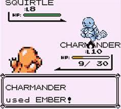

# Ember CRUD

## Lesson Details
### Foundations
At this point, students have already learned how to:

- Configure the Ember Router to point to a new Template.
- Use an Ember View to handle events triggered within a routable template.
- Create nested view states and route to them appropriately.
- Set up resource routes (with their respective Ember Routes).
- Create Ember Components to represent UI elements and encapsulate related data and behavior.
- Use `ember-data` to set up Models representing business data.
- Link the `ember-data` data store to a JSON API through an Adapter.
- Set up a mock back-end using `ember-cli-mirage`

### Objectives
By the end of this lesson, students should be able to:

- Trigger Route `action`s from Templates and Component Templates.
- Create Component `action`s and trigger them from Component Templates.
- Trigger Route `action`s from Component `action`s.
- Add `action`s to an Ember Route for each of the standard CRUD actions (index, create, show, update, destroy) to effect changes onto the Route's model.
- Explain the meaning of the expression "actions up, data down".

### Setup
1. Fork and clone this repo.
2. Run `npm install && bower install`
3. Run `ember install ember-legacy-views`
4. Run `ember install ember-cli-mirage`

## The Shifting Landscape of Ember CRUD
Wow! We've really come a long way with Ember so far. We've learned all about the different parts of an Ember application: Templates, `Ember.View`, `Ember.Route`, `Ember.Router`, `Ember.Component`, `ember-data`, `DS.Model`... Now it's finally time to tie all of this together through one of the core functionalities of most applications, CRUD.

Before talking about CRUD, though, we should start by talking about 'actions'. 'Actions' are a special class of trigger-able events that are handled by the `Ember.ActionHandler` Ember Class. Like normal events, actions will 'bubble' - move from the leaf (i.e. Template) to the root (i.e. the 'application' Route), until they are met by a matching handler.

In Ember 1, actions were used inside the Controller to control Model CRUD. This made sense, since the Controller was responsible for managing all of the business data in our application; an action could be triggered in the Template, bubble up through the View, and reach a Controller, where it would cause the controller to manipulate Model data.

However, with the growing role of Components in Ember 2, a lot of the functionality of Controllers has been made redundant, and the current plan for Ember 2 calls for Controllers to be phased out completely; as a result, we need another place to put action handlers for performing Model CRUD. Fortunately, Components and Routes both incorporate `Ember.ActionHandler`, so we can instead set our action handlers inside either of those objects.

For simplicity's sake, we're going to put all handlers related to Model CRUD into the Route; any other handlers can be placed in either place.

Defining Action handlers in a Route is very easy. Simply open up the `route.js` file and make the following addition:
```javascript
import Ember from 'ember';

export default Ember.Route.extend({
  model: function(...){
    ...
  },
  actions: {
    create: function(){ ... },
    update: function(){ ... },
    destroy: function(){ ... }
    // ... etc
  }
});
```

Inside each of these actions, we can add code to manipulate that Route's model (which, conveniently enough, is provided within the Route). To trigger an action, you can add an `{{action ... }}` helper to an element (usually a button) - this will cause that element to launch the action whenever it executes its defaults behavior (in the case of a button, being clicked).

## Handling Actions in Practice
This has all been fairly abstract, so let's bring it down to earth by looking at how this works in an app. But not just any app...



We're going to make a **Pokemon Directory (a.k.a. 'Pokedex')**, an application that keeps track of Pokemon that we've observed. This app will allows us to do the following CRUD operations:
- Add a new Pokemon to the directory.
- Edit an existing Pokemon.
- Remove a Pokemon from the directory.

As a first step for setting that up, let's give this application a structure for how it should handle actions; then, we can fill out the actions with whatever behavior that app requires.

Let's take a look at our application as it stands right now. It seems that we already have a Mirage test fixture in place, along with a Model to represent a Pokemon and an Adapter to handle the API transactions. Additionally, we have several Templates in place (some of which are already nested). As a result, we can click around and see a list of the Pokemon in our test fixture.

Let's add some action handlers to our Route by opening up `app/pokemon/route.js` and adding the following:
```javascript
actions: {
  createPokemon: function(){
    console.log('Route Action : createPokemon');
  },
  updatePokemon: function(){
    console.log('Route Action : updatePokemon');
  },
  destroyPokemon: function(){
    console.log('Route Action : destroyPokemon');
  }
}
```
Let's also add some HTML/Handlebars to the 'pokemon' Template:
```html
<button {{action 'createPokemon'}}>CREATE</button>
<button {{action 'updatePokemon'}}>UPDATE</button>
<button {{action 'destroyPokemon'}}>DESTROY</button>
```
We should now see three new buttons appear in the 'pokemon' view state. If we click one of these buttons, it will trigger the corresponding action in the Route.

As was mentioned, Routes are not the only things that can have actions; Components can have them too. Let's add some actions to the 'pokemon-snippet' Component:
```javascript
actions: {
  updatePokemon: function(){
    console.log('Component Action : updatePokemon');
  }
}
```
and some new buttons to the Template for 'pokemon-snippet':
```html
<strong>#{{pokemon.nationalPokeNum}} : {{pokemon.name}}</strong>
<button {{action 'updatePokemon'}}>EDIT</button>
<p> Generation: {{pokemon.generation}} </p>
<p> Type: {{pokemon.typeOne}} {{#if twoTypes}}/ {{pokemon.typeTwo}}{{/if}} </p>
```
Clicking these new buttons triggers their respective actions in the Component. Simple enough!

What if we want to trigger a Route action from within a Component? Because Components are essentially modular, this can only be accomplished by passing that action into the Component when the Component is created. Let's modify the 'pokemon' Template as follows:
```html
{{#each model as |pokemon|}}
  {{pokemon-snippet pokemon=pokemon routeUpdatePokemon='updatePokemon' routeDestroyPokemon='destroyPokemon'}}
{{/each}}
```
This will make the `updatePokemon` and `destroyPokemon` Route actions available to the 'pokemon-snippet' Component, under the aliases of `routeUpdatePokemon` and `routeDestroyPokemon`, respectively. To actually trigger one of these actions from within the Component, we can call the method `sendAction`, passing in the name of the desired action as the first argument.
```javascript
actions: {
  updatePokemon: function(){
    console.log('Component Action : updatePokemon');
    this.sendAction('routeUpdatePokemon');
  }
},
```
Now our Component is capable of triggering Route actions!

### YOUR TURN : Handling Actions
Now that you've seen how this works with 'updatePokemon', add actions called `destroyPokemon` to the Route and Component, and add a 'DELETE 'button to the Component Template.

## Non-CRUD Actions
There's no rule that actions need to be related to CRUD. Suppose we wanted to add a button to 'pokemon-snippet' that would toggle between hiding and showing the details (e.g. 'generation') of a given Pokemon. In our Component, let's create a new property, `isExpanded`, and a new action, `toggleExpanded`.
```javascript
export default Ember.Component.extend({
  tagName: 'li',
  twoTypes: Ember.computed('pokemon.typeOne', 'pokemon.typeTwo', function(){
    return this.get('pokemon.typeTwo') && this.get('pokemon.typeTwo') !== this.get('pokemon.typeOne');
  }),
  isExpanded: false,
  actions: {
    toggleExpanded: function(){
      this.toggleProperty('isExpanded');
    },
    updatePokemon: function(){
      console.log('Component Action : updatePokemon');
      this.sendAction('routeUpdatePokemon');
    },
    destroyPokemon: function(){
      console.log('Component Action : destroyPokemon');
      this.sendAction('routeDestroyPokemon');
    }
  }
});
```
Triggering the `toggleExpanded` action will allow us to toggle the value of the `isExpanded` property. Let's make some modifications to the Template for our Component.
```html
<strong>#{{pokemon.nationalPokeNum}} : {{pokemon.name}}</strong>
<button {{action 'toggleExpanded'}}>{{#if isExpanded}}EXPAND{{else}}COLLAPSE{{/if}}</button>
{{#if isExpanded}}
  <button {{action 'updatePokemon'}}>EDIT</button>
  <button {{action 'destroyPokemon'}}>DELETE</button>
  <p> Generation: {{pokemon.generation}} </p>
  <p> Type: {{pokemon.typeOne}} {{#if twoTypes}}/ {{pokemon.typeTwo}}{{/if}} </p>
{{/if}}
```
Now every time the 'EXPAND'/'COLLAPSE' button is clicked, the content inside the `{{#if}}` will toggle between being visible and being hidden.

## CRUD : Destroying a Record
Now let's add some functionality behind those Route actions - any time the `destroyPokemon` Route action is triggered, we destroy a particular Pokemon. The way to destroy a given record from the data store is `<record>.destroyRecord()`. However, before we can destroy a record, we need to find it; we can do this using `<store>.findRecord(<type of record>, <id>)` (when invoked from a Route, the store is accessible at `this.store`). However, the `findRecord` method returns a _Promise_, so we'll need handle that Promise in the usual way.
```javascript
store.findRecord(<type of record>, <id>).then(function(<record>) {
  <record>.destroyRecord();
});
```
Inside the Route's `destroyPokemon` action, that code looks like this.
```javascript
export default Ember.Route.extend({
  model: function(){
    return this.store.findAll('pokemon');
  },
  actions: {
    // ...
    destroyPokemon: function(){
      console.log('Route Action : destroyPokemon');
      this.store.findRecord('pokemon', <id>).then(function(pokemon){
        pokemon.destroyRecord();
      });
    }
  }
});
```
As you can see, we're missing one critical piece of information : the `id` of the particular Pokemon we want to destroy. What we need to do is pass that information from the 'pokemon-snippet' Component (which has access to that particular record) back up to the Route. How can we do that?

As it turns out, the `sendAction` method can optionally accept additional arguments beyond the name of the action that it's triggering. Let's change the Components `destroyPokemon` action so that it passes in the `id` of the Pokemon it refers to.
```javascript
export default Ember.Component.extend({
  // ...
  actions: {
    // ...
    destroyPokemon: function(){
      console.log('Component Action : destroyPokemon');
      this.sendAction('routeDestroyPokemon', this.get('pokemon'));
    }
  }
});
```
Then, we change the Route action so that it can accept an argument, `id`.
```javascript
export default Ember.Route.extend({
  model: function(){
    return this.store.findAll('pokemon');
  },
  actions: {
    // ...
    destroyPokemon: function(pokemon){
      console.log('Route Action : destroyPokemon ' + pokemon.get('id'));
      this.store.findRecord('pokemon', pokemon.get('id')).then(function(pokemon){
        pokemon.destroyRecord();
      });
    }
  }
});
```

As you can see, when we click the 'DELETE' button, the record for that Pokemon gets destroyed.

<!-- ## CRUD : Adding a New Record
Adding a new Pokemon is a behavior tied to the _list_ of Pokemon instead of any particular Pokemon, so it would make the most sense to handle that behavior outside of the 'pokemon-snippet' Component.

Suppose that we wanted to make a `/pokemon/new` view state so that we could bookmark it

## CRUD : Updating an Existing Record


## Additional Resources
List additional related resources such as videos, blog posts and official documentation.
- Item 1
- Item 2
- Item 3 -->
